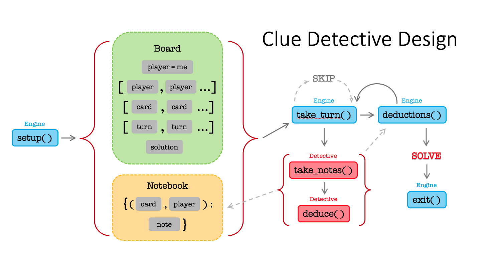

## Project 1 - W200 Introduction to Data Science Programming

Project 1 is an individual project that focuses on the object-oriented principles. The project needs to implement object oriented principles using only the Python Standard Library and should be interactive so that the user can play around with it. The code base needs to be entirely composed of objects and should be called from the command line as a `.py` file so it can be easily ported to to a production scenario.

To play, download **`clue_detective_module`** and run **`clue.py`**

### Clue Detective

Clue is a classic board game where 2-6 players use process of elimination to solve a murder mystery.
The object of the game is to determine who murdered the victim, where the crime took place, and which weapon
was used. Each player attempts to deduce the solution by moving around a game board composed of the rooms of
a mansion and making suggestions to collect clues about the circumstances of the murder from the other players.
Playing the game competitively requires a complex note-taking strategy to maximize the amount of information
gathered in every turn.

The online version of the game provides a beginner-level note-taking feature that keeps track of the basic
information automatically. This smart note-taking program takes this concept to another level by incorporating
advanced strategy automatically. The player inputs what happened each turn, and the program will make all the
deductions that could be made given the current information on hand and add them to the basic notes. Once the
program has deduced a definite solution, it will alert the player to make an accusation.

